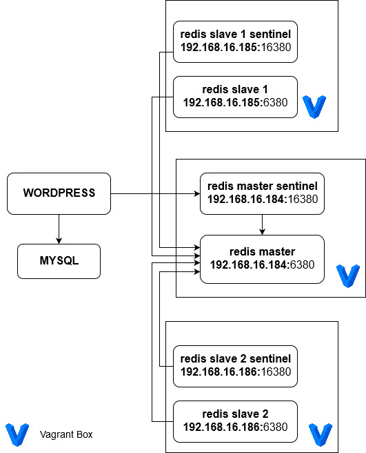

# Implementasi Redis Server Menggunakan Sentinel Untuk High Availability

## Detil Tugas
1. Buatlah sebuah cluster Redis dengan 3 buah node. Tuliskan file konfigurasi yang digunakan
2. Buatlah sebuah web server, kemudian:
    1. Install Wordpress
    2. Konfigurasi Wordpress agar menggunakan Redis cache
3. Buatlah sebuah web server lagi dengan konfigurasi hardware yang sama, kemudian install Wordpress. Pada server ini tidak perlu mengaktifkan Redis cache
4. Lakukan pengujian menggunakan JMeter untuk mengecek perbedaan load time dari dua server web tersebut. Buat kesimpulan dari pengujian yang telah dilakukan.
5. Lakukan pula pengujian untuk menunjukkan bahwa proses fail over menggunakan Redis Sentinel berhasil. Caranya dengan mematikan salah satu server Redis dan mengecek siapa master node baru yang terpilih.

## Deskripsi Singkat

## Implementasi Arsitektur

