# Implementasi Redis Server Menggunakan Sentinel Untuk High Availability

## Deskripsi Singkat Tentang Redis Sentinel
Redis Sentinel adalah sistem yang dirancang untuk membantu mengelola instance Redis. Redis Sentinel melakukan tiga tugas berikut:

1. Pemantauan. Sentinel terus-menerus memeriksa apakah instance master dan slave Anda berfungsi seperti yang diharapkan.
2. Pemberitahuan. Sentinel dapat memberi tahu administrator sistem, atau program komputer lain, melalui API, bahwa ada sesuatu yang salah dengan salah satu instance Redis yang dipantau.
3. Kegagalan otomatis. Jika master tidak berfungsi seperti yang diharapkan, Sentinel dapat memulai proses failover di mana seorang budak dipromosikan menjadi master, budak tambahan lainnya dikonfigurasi ulang untuk menggunakan master baru, dan aplikasi menggunakan server Redis menginformasikan tentang alamat baru yang akan digunakan saat menghubungkan.

Redis Sentinel adalah sistem terdistribusi, ini berarti bahwa biasanya Anda ingin menjalankan beberapa proses Sentinel di seluruh infrastruktur Anda, dan proses ini akan menggunakan protokol perjanjian untuk memahami jika master turun dan untuk melakukan failover.

Redis Sentinel dikirimkan sebagai executable yang berdiri sendiri yang disebut `redis-sentinel` tetapi sebenarnya itu adalah mode eksekusi khusus dari server Redis itu sendiri, dan dapat juga dipanggil menggunakan opsi `--sentinel` dari `redis-sever` yang normal yang dapat dieksekusi.


## Implementasi Arsitektur


Masing-masing dalam bentuk Vagrant Box yang terdiri dari tiga node:
- redis-master :
    ```
    OS: ubuntu-18.04
    RAM: 1844 MB
    IP: 192.168.16.184
    ```
- redis-slave-1 :
    ```
    OS: ubuntu-18.04
    RAM: 1844 MB
    IP: 192.168.16.185
    ```
- redis-slave-2 :
    ```
    OS: ubuntu-18.04
    RAM: 1844 MB
    IP: 192.168.16.186 
    ```
## Direktori Folder
- `/conf` : berisi file konfigurasi untuk disalin ke masing-masing node sesuai perintah file yang berada di `/provision`.
- `/provision` : berisi file perintah untuk mengatur (provisioning) masing-masing vagrant box.
- `Vagrantfile` : merupakan file utama yang dibutuhkan vagrant ketika mengeksekusi `vagrant up`. File berisi definisi-definisi yang diperlukan untuk membentuk box-box didalam repository ini.
## Demo
### Inisiasi Sistem
1. Eksekusi `vagrant up` dari repository ini
2. Eksekusi `vagrant ssh redis_master` dan eksekusi `sudo redis-server /etc/redis/redis.conf`
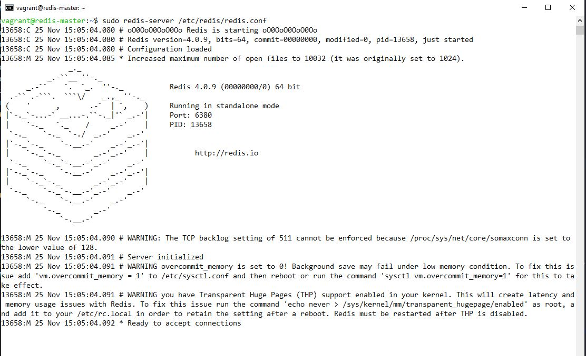
3. Buka cmd baru, kemudian eksekusi `vagrant ssh redis_master` dan eksekusi `sudo redis-server /etc/redis/sentinel.conf --sentinel`

4. Buka cmd baru, kemudian eksekusi `vagrant ssh redis_slave_1` dan eksekusi `sudo redis-server /etc/redis/redis.conf`
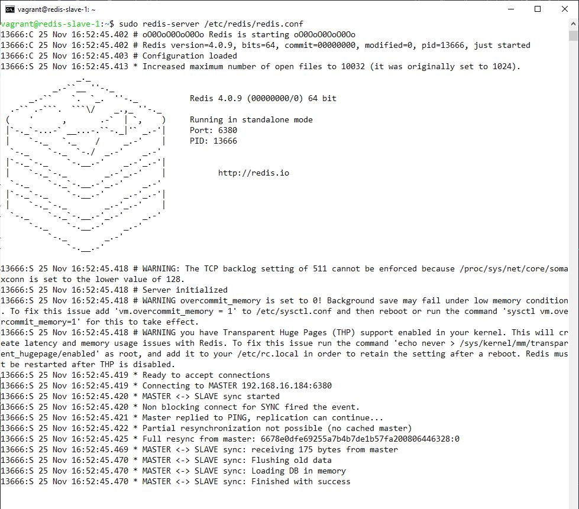
5. Buka cmd baru, kemudian eksekusi `vagrant ssh redis_slave_1` dan eksekusi `sudo redis-server /etc/redis/sentinel.conf --sentinel`
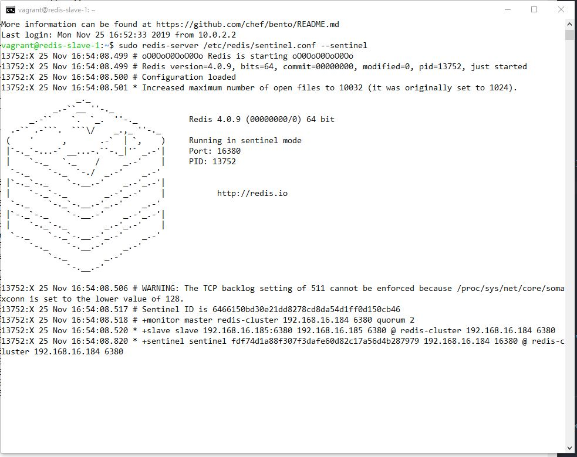
6. Buka cmd baru, kemudian eksekusi `vagrant ssh redis_slave_2` dan eksekusi `sudo redis-server /etc/redis/redis.conf`
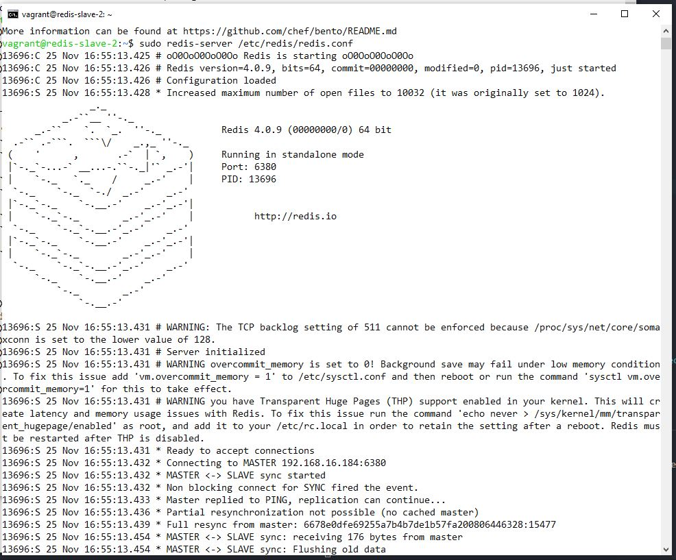
7. Buka cmd baru, kemudian eksekusi `vagrant ssh redis_slave_2` dan eksekusi `sudo redis-server /etc/redis/sentinel.conf --sentinel`
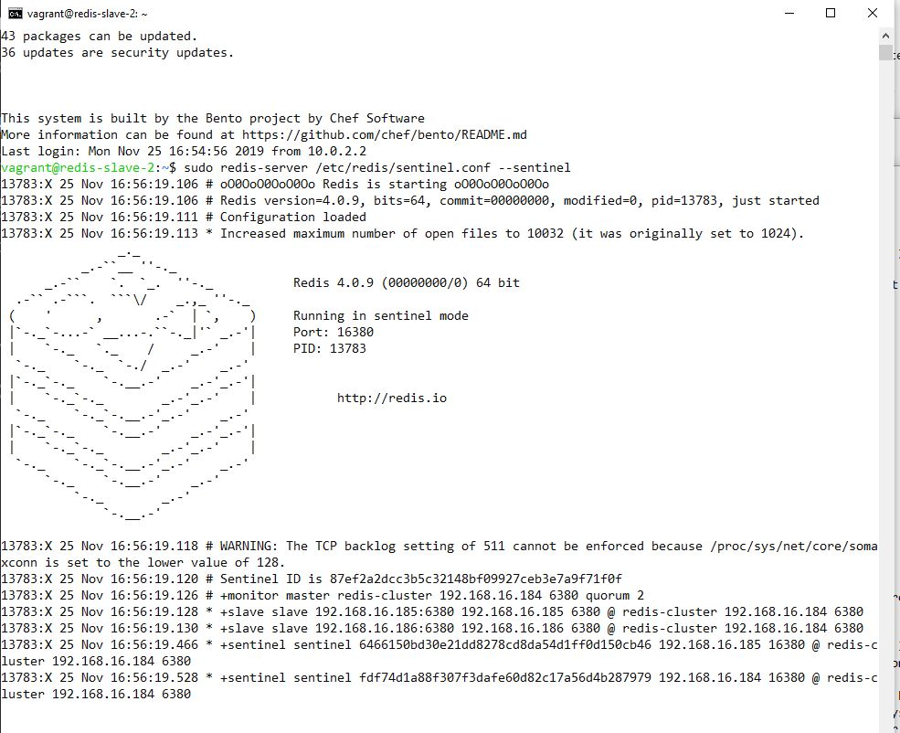
8. Cek kembali ke redis_master pada perintah "13", akan muncul hasil seperti gambar

9.  Buka cmd baru, masuk ke salah satu server dan eksekusi untuk menemukan address master masing-masing server 
```
redis-cli -h 192.168.16.184 -p 16380 sentinel get-master-addr-by-name redis-cluster
redis-cli -h 192.168.16.185 -p 16380 sentinel get-master-addr-by-name redis-cluster
redis-cli -h 192.168.16.186 -p 16380 sentinel get-master-addr-by-name redis-cluster
```
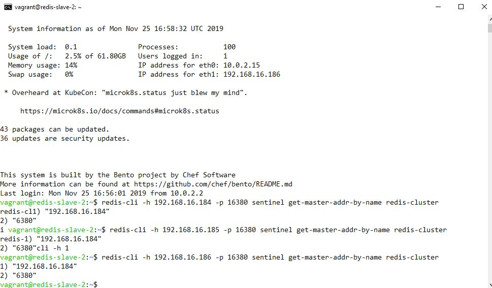
10. Eksekusi `redis-cli -h 192.168.16.184 -p 6380`, lalu eksekusi `info replication`
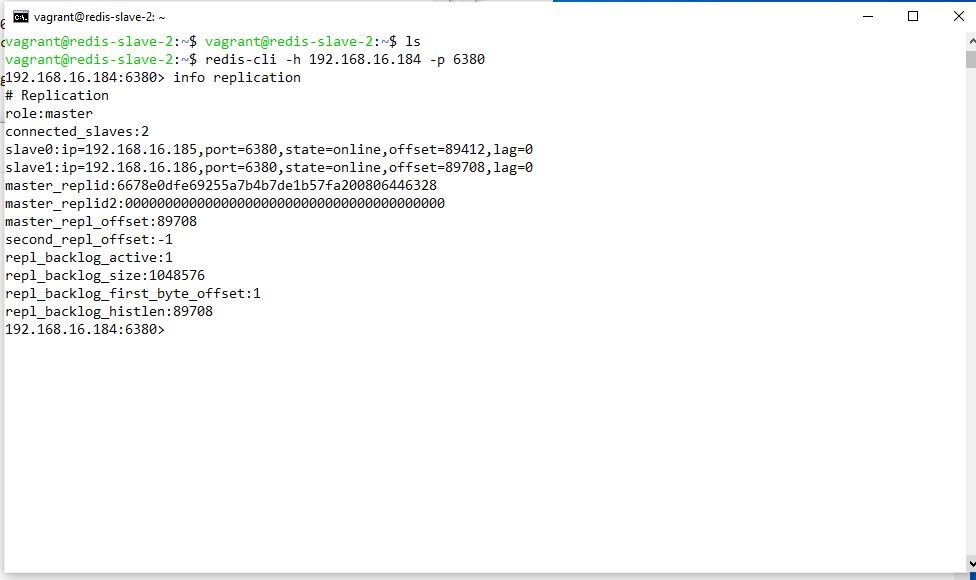
11. Eksekusi `redis-cli -h 192.168.16.185 -p 6380`, lalu eksekusi `info replication` 

12. Eksekusi `redis-cli -h 192.168.16.186 -p 6380`, lalu eksekusi `info replication`  
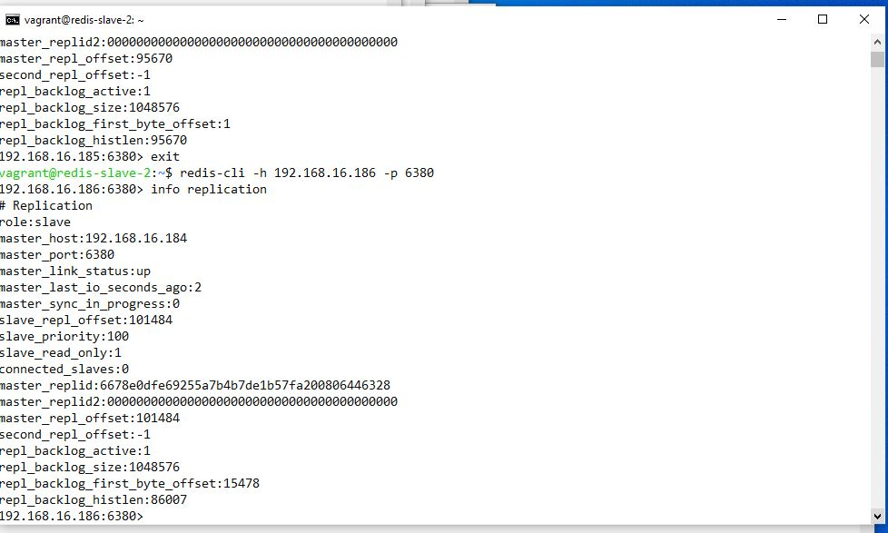
13. Eksekusi `redis-cli -h 192.168.16.184 -p 16380`, lalu eksekusi `info sentinel`  
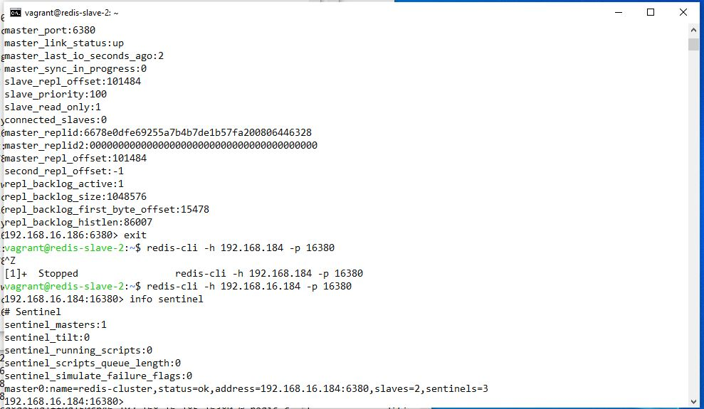
14. Eksekusi `redis-cli -h 192.168.16.185 -p 16380`, lalu eksekusi `info sentinel`  
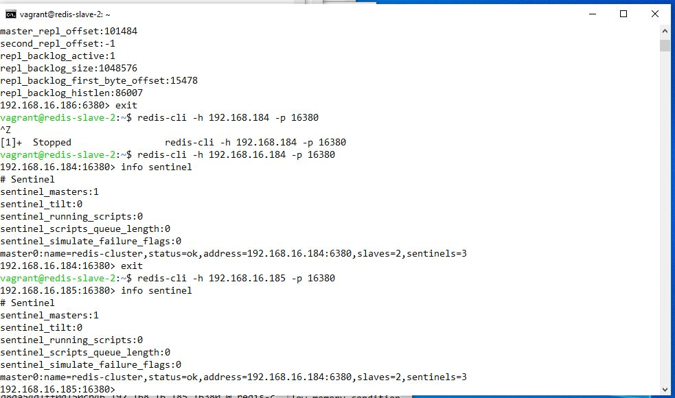
15. Eksekusi `redis-cli -h 192.168.16.186 -p 16380`, lalu eksekusi `info sentinel` 
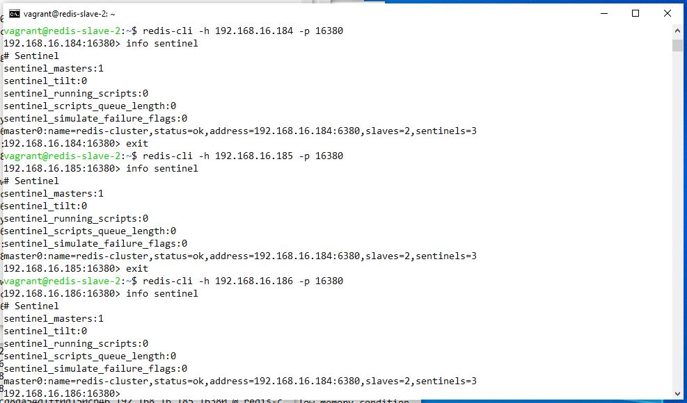
### Uji Perbandingan Kecepatan Load Wordpress Dengan Redis Dan Tanpa Redis
#### Inisiasi
Uji coba ini mengasumsikan bahwa pengguna:
1. Sudah memiliki web server dengan wordpress tersedia untuk uji coba.
2. Web server menggunakan local dengan enable plugin dan disable plugin saat testing. 
3. Menginstall Jmeter dengan tutorial https://www.blazemeter.com/blog/how-get-started-jmeter-part-1-installation-test-plans/

Prasyarat Konfigurasi:
1. Tambahkan cuplikan berikut di `wp-config.php`
```php
define('WP_REDIS_CLIENT', 'predis');
define('WP_REDIS_SENTINEL', 'redis-cluster');
define('WP_REDIS_SERVERS',[
	'tcp://192.168.16.184:16380',
	'tcp://192.168.16.185:16380',
	'tcp://192.168.16.186:16380',
]);
```
2. Ubah tulisan INFO menjadi info pada `wp-content\plugins\redis-cache\includes\predis\src\CommandServerInfo.php`
3. Enable plugin, dan cek `diagnostic`

#### Beberapa Halaman Sampel Wordpress
1. Terdiri dari banyak teks

2. Terdiri dari teks dan gambar

3. Terdiri dari kupulan gambar


#### Uji Tes
1. Tes request 50 koneksi Tanpa Redis

2. Tes request 50 koneksi Dengan Redis

3. Tes request 203 koneksi Tanpa Redis

4. Tes request 203 koneksi Dengan Redis


#### Hasil 
Dari hasil uji tes menunjukkan bahwa Wordpress yang menggunakan redis memiliki rata-rata sampling time lebih lambat. Hal ini dapat disebabkan  post yang tersimpan di redis memiliki string value yang besar.

### Uji Penunjukan Master Baru Dengan Metode Failover
Redis sentinel memiliki fitur untuk menunjuk master baru apabila master terdahulu tidak lagi aktif. Hal ini dimungkinkan karena terdapat sentinel yang melakukan pengamatan aktif kepada node-node yang ada. Sentinel akan melakukan 'voting' terlebih dahulu baru kemudian menentukan master.
Untuk mencoba uji metode failover:
1. Masuk ke server sembarang kemudian matikan dengan
   `redis-cli -h 192.168.16.184 -p 6380 debug segfault`
2. Pastikan redis master mati (dalam hal ini `192.168.184`)
3. Cek dengan cara
```
redis-cli -h 192.168.16.184 -p 16380 sentinel get-master-addr-by-name redis-cluster
redis-cli -h 192.168.16.185 -p 16380 sentinel get-master-addr-by-name redis-cluster
redis-cli -h 192.168.16.186 -p 16380 sentinel get-master-addr-by-name redis-cluster
```

4. Penunjukan `192.168.16.185` sebagai master baru berhasil